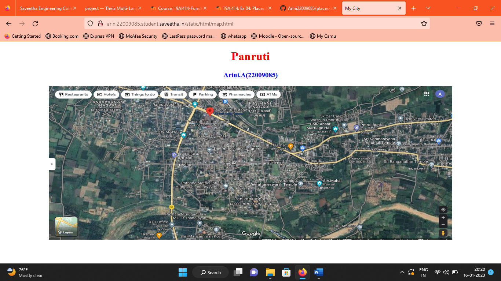
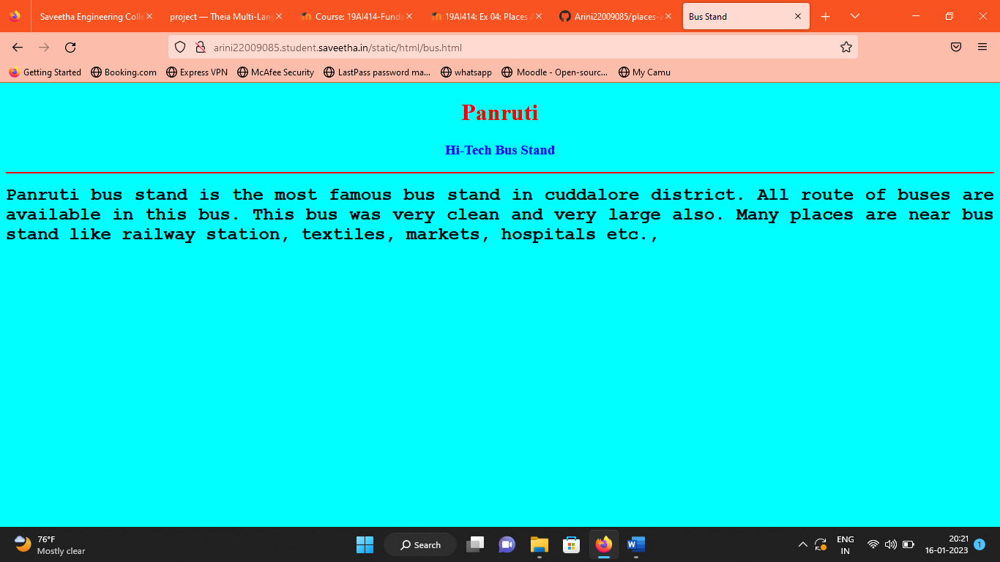
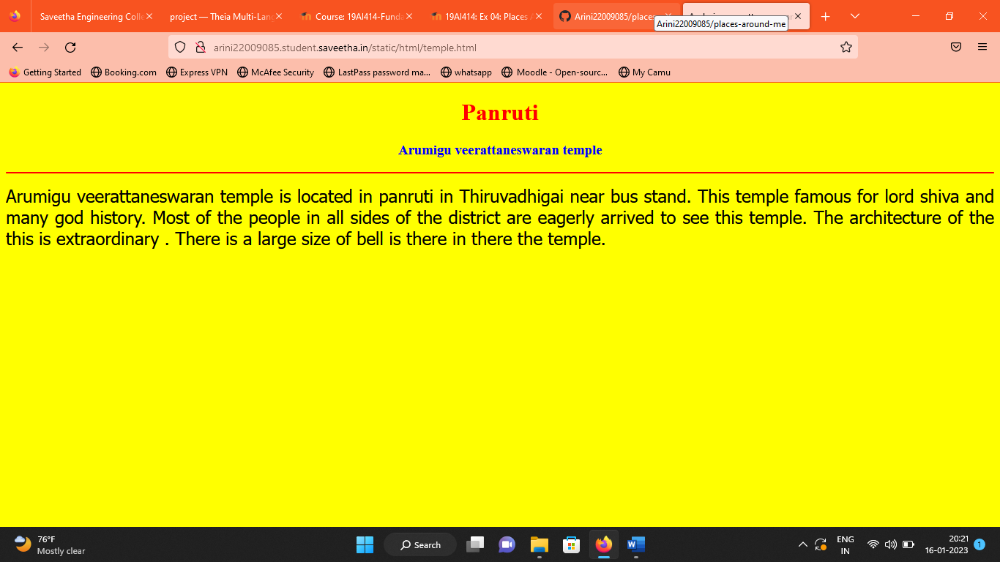
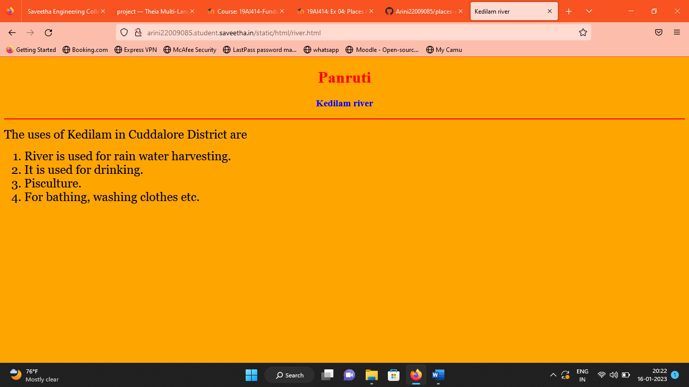
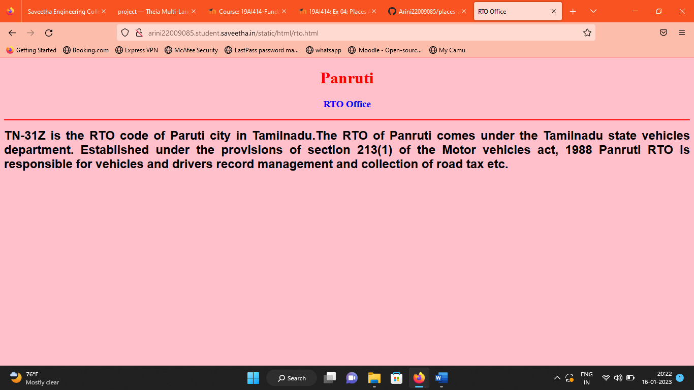
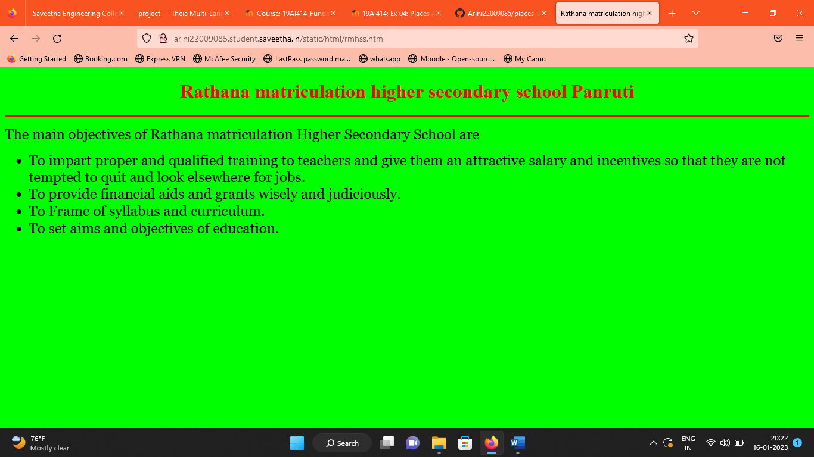
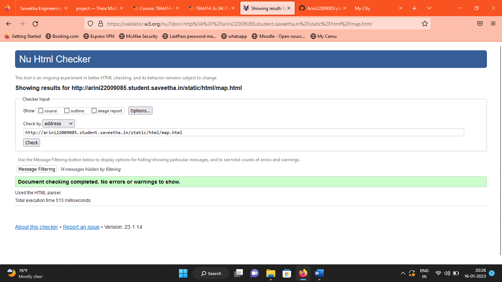

# Places Around Me
## AIM:
To develop a website to display details about the places around my house.

## Design Steps:

### Step 1:
Clone the github repository into Theia IDE.

### Step 2:
Create a new Django project

### Step 3:
Write the needed HTML code.

### Step 4:
Run the Django server and execute the HTML files.

## Code:
```
map.html

<!DOCTYPE html>
<html lang="en">
<head>
<title>My City</title>
</head>
<body>
<h1 align="center">
<font color="red"><b>Panruti</b></font>
</h1>
<h3 align="center">
<font color="blue"><b>Arini.A(22009085)</b></font>
</h3>
<center>

<map name="MyCity">
<area shape="circle" coords="190,50,20" href="/static/html/rmhss.html" title="Rathana matriculation higher secondary school">
<area shape="rectangle" coords="230,30,260,60" href="/static/html/rto.html" title="RTO Office">
<area shape="circle" coords="400,350,50" href="/static/html/river.html" title="Kedilam river">
<area shape="circle" coords="400,200,75" href="/static/html/bus.html" title="Hi-Tech Bus Stand">
<area shape="rectangle" coords="490,150,870,320" href="/static/html/temple.html" title="Arulmigu veettaneswarar temple">
</map>
</center>
</body>
</html>

bus.html

<!DOCTYPE html>
<html lang="en">
<head>
<title>Bus Stand</title>
</head>
<body bgcolor="cyan">
<h1 align="center">
<font color="red"><b>Panruti</b></font>
</h1>
<h3 align="center">
<font color="blue"><b>Hi-Tech Bus Stand</b></font>
</h3>
<hr size="3" color="red">
<p align="justify">
<font face="Courier New" size="5">
<b>
Panruti bus stand is the most famous bus stand in cuddalore district. All route of buses are available in this bus. This bus was very clean and very large also. Many places are near bus stand like railway station, textiles, markets, hospitals etc., 
</b>
</font>
</p>
</body>
</html>

temple.html

<!DOCTYPE html>
<html lang="en">
<head>
<title>Arulmigu veerattaneswaran temple </title>
</head>
<body bgcolor="yellow">
<h1 align="center">
<font color="red"><b>Panruti</b></font>
</h1>
<h3 align="center">
<font color="blue"><b>Arumigu veerattaneswaran temple</b></font>
</h3>
<hr size="3" color="red">
<p align="justify">
<font face="Tahoma" size="5">
Arumigu veerattaneswaran temple is located in panruti in Thiruvadhigai near bus stand. This temple famous for lord shiva and many god history. Most of the people in all sides of the district are eagerly arrived to see this temple. The architecture of the this is extraordinary . There is a large size of bell is there in there the temple.
 </font>
</p>
</body>
</html>

rto.html

<!DOCTYPE html>
<html lang="en">
<head>
<title>RTO Office</title>
</head>
<body bgcolor="pink">
<h1 align="center">
<font color="red"><b>Panruti</b></font>
</h1>
<h3 align="center">
<font color="blue"><b>RTO Office</b></font>
</h3>
<hr size="3" color="red">
<p align="justify">
<font face="Arial" size="5">
<b>
TN-31Z is the RTO code of Paruti city in Tamilnadu.The RTO of Panruti comes under the Tamilnadu state vehicles department. Established under the provisions of section 213(1) of the Motor vehicles act, 1988 Panruti RTO is responsible for vehicles and drivers record management and collection of road tax etc. 
</b>
</font>
</p>
</body>
</html>

rmhss.html

<!DOCTYPE html>
<html lang="en">
<head>
<title>Rathana matriculation higher secondary school </title>
</head>
<body bgcolor="lime">
<h1 align="center">
<font color="red"> Rathana matriculation higher secondary school <b>Panruti</b></font>
</h1>
<h3 align="center">
<font color="blue"><b> </b></font>
</h3>
<hr size="3" color="red">
<p align="justify">
<font face="Georgia" size="5">
The main objectives of Rathana matriculation Higher Secondary School are 
<ul>
<li>To impart proper and qualified training to teachers and give them an attractive salary and incentives so that they are not tempted to quit and look elsewhere for jobs.</li>
<li>To provide financial aids and grants wisely and judiciously.</li>
<li>To Frame of syllabus and curriculum.</li>
<li>To set aims and objectives of education.</li>
</ul>
</font>
</p>
</body>
</html>

river.html

<!DOCTYPE html>
<html lang="en">
<head>
<title>Kedilam river </title>
</head>
<body bgcolor="orange">
<h1 align="center">
<font color="red"><b>Panruti </b></font>
</h1>
<h3 align="center">
<font color="blue"><b>Kedilam river </b></font>
</h3>
<hr size="3" color="red">
<p align="justify">
<font face="Georgia" size="5">
The uses of Kedilam in Cuddalore District are 
<ol type="1">
<li>River is used for rain water harvesting.</li>
<li>It is used for drinking.</li>
<li>Pisculture.</li>
<li>For bathing, washing clothes etc.</li>
</ol>
</font>
</p>
</body>
</html>
```
## Output:













## HTML Validator 


## Result:
The program for implementing image map is executed successfully
